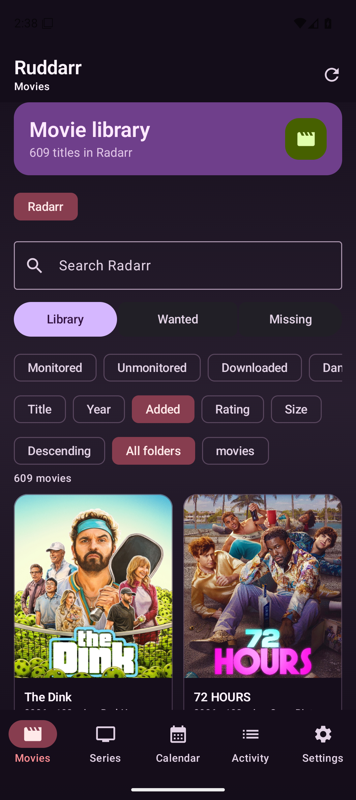
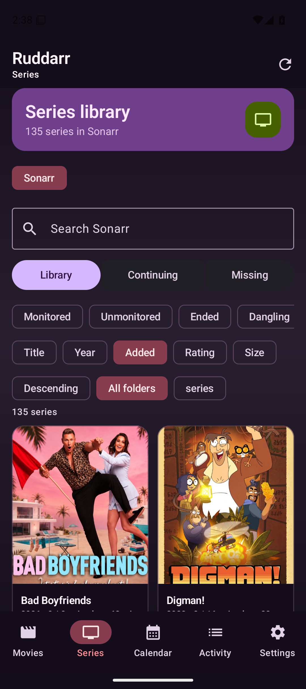
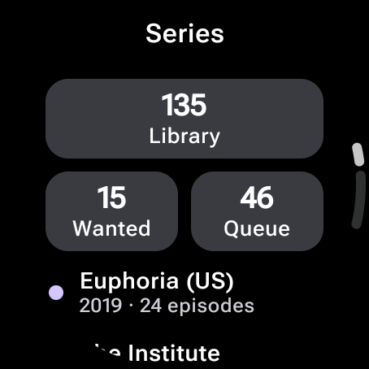

# Ruddarr for Android

A native Kotlin and Jetpack Compose client for self-hosted Radarr and Sonarr instances. This is Raphael Bleier's Android port of Ruddarr, built for local Arr-server management without an account, Firebase, cloud synchronization, subscriptions, or push registration.

## Features

- Manage Radarr movies and Sonarr series across multiple instances
- Search, add, edit, monitor, delete, and trigger automatic searches
- Browse movies, series, seasons, episodes, calendar releases, queue activity, and history
- Load library covers directly from local Arr instances, with an external-image fallback
- Send interactive releases to the correct movie, season, or episode
- Manually import queued files and manage Arr webhooks
- Filter and sort libraries, calendar items, activity, and release results locally
- Store API keys and instance settings encrypted with Android Keystore
- Use Material 3 Expressive with a contrast-checked dark palette and expressive motion
- Use a standalone Wear OS client with Material 3 Expressive, swipe-dismiss navigation, and direct local Arr status

## Screenshots

### Android

<p>
  
  
</p>

### Wear OS

<p>
  
</p>

## Requirements

- Android 8.0 (API 26) or newer
- Wear OS 3 (API 30) or newer for the watch app
- A reachable, self-hosted Radarr and/or Sonarr instance with an API key

## Install

Download the signed Android or Wear OS APK from the [GitHub Releases](https://github.com/raphaelbleier/rudarr_android/releases) page and install it on your device.

## Local development

```bash
./gradlew :app:assembleDebug
./gradlew :app:connectedDebugAndroidTest
./gradlew :wearApp:assembleDebug
./gradlew :wearApp:testDebugUnitTest
```

Add instances directly in **Settings**. For a private debug seed file, copy `app/src/debug/assets/seed-instances.example.json` to `app/src/debug/assets/seed-instances.json`, fill in your local instance values, and use **Load debug instance seeds**. The seed file is ignored by Git.

The Wear OS app is standalone: configure its local Radarr and Sonarr URLs directly on the watch. Its credentials are stored separately with Android Keystore and it makes direct local network requests; no cloud account or Firebase is involved.

See [DEVELOPMENT.md](DEVELOPMENT.md) for setup, architecture, and local verification, and [CONTRIBUTING.md](CONTRIBUTING.md) for contribution expectations.

The repository ships an Android release workflow. It requires these GitHub Actions secrets:

- `ANDROID_KEYSTORE_BASE64`
- `ANDROID_KEYSTORE_PASSWORD`
- `ANDROID_KEY_ALIAS`
- `ANDROID_KEY_PASSWORD`

Pushing an `android-v*` tag builds, verifies, and publishes signed Android and Wear OS APKs.

## Attribution and license

The Android port is copyright © 2026 Raphael Bleier. The repository retains original Ruddarr sources by Till Krüss; their copyright notice is preserved in the MIT license.
